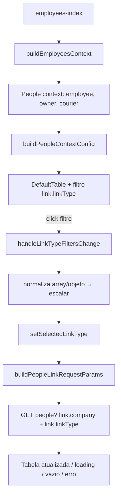
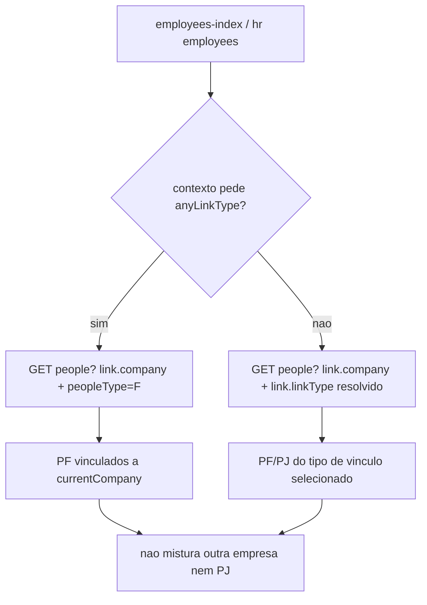

# People list — filtros de `linkType` e `employees-index` (owners)

Documentação técnica da listagem genérica de pessoas (`People.js`) quando usada como **índice de colaboradores** (`employees-index`), incluindo inclusão de `owner` e o contrato dos filtros de tipo de vínculo.

Trilha de origem: [app-community#760](https://github.com/ControleOnline/app-community/issues/760).

## Como este módulo se encaixa

| Visão (`APP_TYPE`) | Uso neste fluxo |
| --- | --- |
| **MANAGER** | Rota `/employees-index` lista colaboradores da empresa ativa (`currentCompany`); filtros de tipo de vínculo (employee, owner, courier, …) controlam a consulta |
| **CRM** / outros | Podem reutilizar `People` com `context` diferente; o contrato de filtro `link.linkType` e o escopo por company são os mesmos |

- `ui-people` é o **dono** da página de lista (`People.js`), da normalização de contexto (`peopleContext.js`) e dos parâmetros de vínculo (`peopleLinkFilters.js`).
- `ui-customers` apenas **compõe** a rota de colaboradores (`src/react/pages/employees.js` → `buildEmployeesContext` → `<People />`).
- Backend de leitura: coleção de pessoas com filtro de `people_link` (`link.company` + `link.linkType`) em `api-platform-people` — esta página **não** redefine autorização nem criação/remoção de vínculos.

## Objetivo

Registrar:

1. como `employees-index` monta o contexto (tipos disponíveis, default, títulos);
2. como o filtro de tipo de vínculo dispara reconsulta;
3. por que `owner` precisa estar no `context` e no valor enviado em `link.linkType`;
4. distinção de navegação `companyId` (contexto empresa) vs `clientId` (contexto pessoa).

## Repositórios afetados

| Módulo | Papel no fluxo |
| --- | --- |
| `ui-people` | `People.js`, `peopleContext.js`, `peopleLinkFilters.js`, `MyCompaniesPage.js` (params de detalhe) |
| `ui-customers` | Wrapper `employees.js` / `buildEmployeesContext` |
| `app-community` | Rota `/employees-index`, pin dos submódulos |
| `api-platform-people` | Contrato de leitura `link.company` + `link.linkType` (inalterado no #760 quanto a authZ) |

## Regras de negócio (UI)

### Entrada — `employees-index`

Rota típica: `/employees-index` (MANAGER).

O wrapper em `ui-customers` monta o contexto assim (resumo):

```js
// buildEmployeesContext(route.params)
context: ['employee', 'owner', 'courier']   // ou override via route.params.context
defaultContext / selectedContext: 'employee' // ou selectedContext da rota
defaultPeopleType: 'J' (exceto courier → 'F')
modalTitleByType: { employee, owner, courier }
```

Consequências:

- `buildPeopleContextConfig` expõe `availableTypes` com **owner incluído**.
- `hasTypeFilter === true` (mais de um tipo) → DefaultTable mostra o seletor/filtro de `link.linkType`.
- Sem `owner` no array de contexto, a UI **não** oferece o chip/filtro e a listagem default não pede esse tipo.

### Parâmetros de leitura

`buildPeopleLinkRequestParams({ currentCompany, selectedLinkType })`:

| Param | Origem | Observação |
| --- | --- | --- |
| `link.company` | IRI de `currentCompany` (`/people/{id}`) | Escopo de tenant/company; **não** listar vínculos de outra empresa |
| `link.linkType` | `selectedLinkType` normalizado (minúsculo) | Valor escalar do tipo ativo (ex.: `owner`, `employee`) |

Montagem do filtro de colunas da tabela:

- coluna `link.linkType` usa `contextConfig.options` / tipos disponíveis;
- mudança no filtro chama `handleLinkTypeFiltersChange`.

### Normalização do valor do filtro (#760)

O controle de filtro (DefaultTable / chips) pode devolver o valor como:

- string (`'owner'`);
- objeto `{ value: 'owner' }`;
- array (`['owner']`).

`handleLinkTypeFiltersChange` **deve** extrair o escalar antes de normalizar:

```text
raw = nextFilters['link.linkType']
selectedValue = Array.isArray(raw) ? raw[0] : (raw?.value ?? raw)
nextLinkType = normalizePeopleContextType(selectedValue) || defaultType
```

Só então:

1. `setSelectedLinkType` se o tipo estiver em `availableTypes`;
2. a dependência de `selectedLinkType` reconstroi os params e **dispara nova busca**.

Sem essa normalização, clicar no filtro de tipo não atualizava `selectedLinkType` → a tabela não reconsultava e owners podiam ficar invisíveis mesmo com chip “Proprietário”.

### Inclusão de owners

Owners aparecem quando **todas** as condições abaixo são verdadeiras:

1. `owner` está em `context` / `availableTypes` (wrapper `employees.js` já inclui);
2. o filtro ativo é `owner` **ou** a consulta default do contexto cobre esse tipo conforme o contrato da API usada pela store;
3. existe `people_link` com `linkType=owner` para a `currentCompany` do usuário;
4. o payload da API retorna a pessoa no escopo da company (sem vazamento cross-company).

### Navegação para detalhe — `companyId` vs `clientId` (#760)

Ao abrir o detalhe a partir de listas de **empresa** (`MyCompaniesPage` / contexto company):

- preferir **`companyId`** nos params da rota de detalhe;
- **não** forçar `clientId` quando o destino é detalhe de pessoa jurídica no papel de company.

Em `People.js`, ao montar `detailsRouteParams`:

- se `baseParams.companyId` existir → usar `companyId` e remover `clientId`;
- caso contrário → manter `clientId` (fluxo de pessoa/cliente).

Isso alinha a seed da tela de detalhe com o contexto real (empresa vs pessoa) e evita first-paint inconsistente.

## Fluxo resumido



## Modularização

| Artefato | Responsabilidade |
| --- | --- |
| `ui-customers/.../employees.js` | Monta `context` da rota colaboradores; **não** implementa fetch |
| `ui-people/.../People.js` | Lista, estado `selectedLinkType`, handlers de filtro, navegação |
| `ui-people/.../peopleContext.js` | Único ponto de normalização de tipos/labels/default |
| `ui-people/.../peopleLinkFilters.js` | IRI company, `buildPeopleLinkRequestParams`, `HUMAN_COMPANY_LINK_TYPES` |
| `ui-people/.../MyCompaniesPage.js` | Params de detalhe com `companyId` no contexto empresa |

Não espalhar parsing de valor de filtro (`array` / `{value}`) fora de `handleLinkTypeFiltersChange` / helpers de people.

## Estados de UI preservados

- **Loading**: enquanto a store de people busca com os novos params.
- **Vazio**: resposta sem itens para o `linkType` + company atuais.
- **Erro**: falha de rede/API continua no mesmo caminho da lista genérica.
- **Paginação / busca textual**: independentes do filtro de tipo; não devem ser resetadas de forma destrutiva além do contrato já usado por `People`.

## Colaborador da empresa atual (#981 / #967)

Regra de negócio da listagem de colaboradores:

**Colaborador** = todo `people` com `peopleType = F` atrelado, via `peopleLink`, ao `people` `peopleType = J` que é a `currentCompany`, **independente do `linkType` do vínculo**.

O que este módulo faz e o que não faz:

| Módulo | Faz | Não faz |
| --- | --- | --- |
| `ui-people` | Dono de `buildPeopleLinkRequestParams`. Desde `@controleonline/ui-people@1.0.95`, aceita `peopleType` e `anyLinkType`. Com `anyLinkType: true` omite `link.linkType` e envia `link.company` + `peopleType`. Demais telas de `People` (clientes, fornecedores, etc.) **não** ligam `anyLinkType` e continuam filtrando por `link.linkType`. | Não cria vínculo, não autoriza e não mistura empresas. |
| `ui-customers` | Compõe a rota real `employees-index` / `EmployeesIndex` (`employees.js` → `buildEmployeesContext` → `<People />`). Correção de lista vazia da [#967](https://github.com/ControleOnline/app-community/issues/967): params sempre passam por `buildPeopleLinkRequestParams` (company + `linkType` resolvido, inclusive expansão de `all`). | Não duplica o builder de params. |
| `ui-employee` | `EmployeesPage` pode repassar `peopleType: 'F'` e `anyLinkType: true` no contexto `employment`. Esse contexto **não** é um `linkType` válido; sem `anyLinkType` a request `link.linkType=employment` volta vazia. A rota de produto usada em produção é a de `ui-customers`; o pacote npm não publica `ui-employee`. | Não é a fonte da rota `/employees-index`. |
| `api-platform-people` | Já expõe leitura com `peopleType` e `link.company` (e `link.linkType` quando enviado). Sem delta de backend nesta trilha. | Não redefine o significado de colaborador no frontend. |

Contrato quando o contexto pede a regra de colaborador:

| Param | Valor | Efeito |
| --- | --- | --- |
| `link.company` | `/people/{currentCompany.id}` | Escopo da empresa ativa. Troca de `currentCompany` reconsulta. |
| `peopleType` | `F` | Só pessoa física. Não lista PJ. |
| `link.linkType` | omitido se `anyLinkType` | Qualquer vínculo `peopleLink` com a empresa conta. Sem `anyLinkType`, o filtro de tipo (#760) continua valendo. |



A [#981](https://github.com/ControleOnline/app-community/issues/981) foi encerrada como duplicata da [#967](https://github.com/ControleOnline/app-community/issues/967): a tela de produto é `EmployeesIndex` em `ui-customers`. O contrato `anyLinkType` ficou publicado em `ui-people@1.0.95` (tag `v1.0.95`, pin da RC `1.10.45` / `v1.10.45`) e permanece disponível para quem montar o contexto de colaborador sem restringir `linkType`.

## Fora de escopo (documentado por contraste)

- Alterar regras de autorização de `people_link`.
- Criar ou remover vínculos (aba Colaboradores no Client Details — ver [Client-Details-EmployeesTab-Refresh](https://github.com/ControleOnline/ui-customers/wiki/Client-Details-EmployeesTab-Refresh)).
- Aplicar `anyLinkType` nas listas de cliente, fornecedor ou outros contextos que dependem de `link.linkType`.

## Referências

- Issue filtros / owners: https://github.com/ControleOnline/app-community/issues/760
- Issue lista vazia (rota real): https://github.com/ControleOnline/app-community/issues/967
- Issue regra PF + qualquer linkType: https://github.com/ControleOnline/app-community/issues/981
- Pacote: `@controleonline/ui-people@1.0.95` (`buildPeopleLinkRequestParams`)
- Home deste módulo: [Home](Home)
- Home `ui-employee`: https://github.com/ControleOnline/ui-employee/wiki
- Home `ui-customers`: https://github.com/ControleOnline/ui-customers/wiki
- Home `api-platform-people`: https://github.com/ControleOnline/api-platform-people/wiki
- Regras de vínculo: [Regras-de-Negocio](Regras-de-Negocio)
- App-Home: https://github.com/ControleOnline/app-community/wiki
